# Introduction
This is the Google Data Analytics Capstone project. For the purpose of this project, I assume the role of a Junior Data Analyst at a fictitious bike rental company, Cyclistic. This project involves understanding business questions, proferring data- driven solutions and sharing findings through data visulaization and reports. 

# Skills Demonstrated
For the effective execution of this project, the following skills were utilized;
1. Understanding of business problem.
2. Data analysis with SQL utilizing various DDL, DQL, DDL and DML.
3. Sharing insights through compelling data visualisation and reports.
4. Critical and creative thinking.
5. Problem solving

# Dataset
The dataset used was provided by Google and can be found [here](https://divvy-tripdata.s3.amazonaws.com/index.html). The data consists of 12 months data including 13 columns and upon joining the 12 months data together, 5,667,717 rows. One limitation of the dataset is the presence of lots of blanks under the Start and End station name columns. Save for that, the data is reliable, complete, current and comprehensive, with relevant columns and does not contain duplicates.

# Problem Statement
Cyclistic, a bike rental company, offers flexible pricing plans including single-ride passes, full-day passes, and annual memberships. Although profitable overall, a financial analysis has revealed that annual memberships yield the highest profitability. Consequently, rather than a generic campaign, the marketing team intends to target casual riders with the goal of converting them to annual members. To accomplish this, they aim to understand the user behavior of both casual and annual members, identifying differences and similarities, and exploring how digital media can influence their marketing strategies. This will involve analyzing Cyclistic's historical trip data to uncover trends.

The following business questions will be answered to gain required insights;

1. How does the total number of rides vary between different user types?
2. How are rides distributed throughout the week among Cyclistic users?
3. What is the monthly distribution pattern of rides among Cyclistic users?
4. What is the daily distribution pattern of rides among Cyclistic users?
5. What is the average duration of rides taken by Cyclistic users?
6.  Which bike type is most preferred by Cyclistic users?

# Process
For the execution of this project, SQL will be utilized for indepth analysis and Power BI for the visualization and sharing of insights to key stakeholders. I started off by creating tables and loading the 12 months data into postgresql

Then, went ahead to combine all 12 months data into a single view for easy and proper analysis.

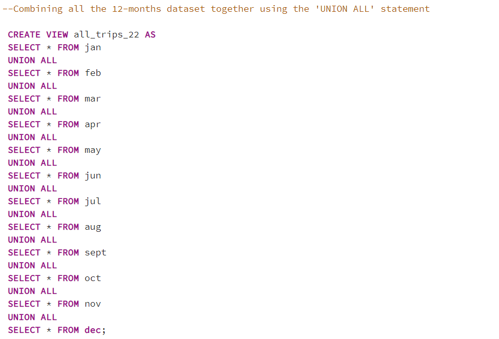
Before commensing indepth analysis, I changed the column name 'member-casual' to 'user-type' for clarity

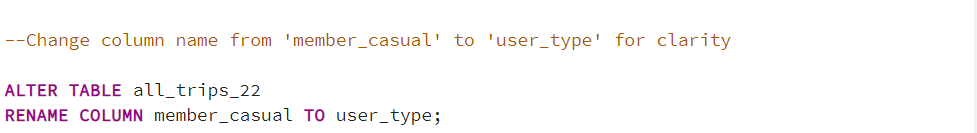

# Data Analysis
ALL codes used for indepth analysis can be found [here](GDA_cyclystic_capstone_project)

**1. How does the total number of rides vary between different user types?**
   
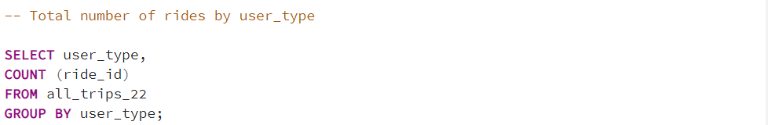   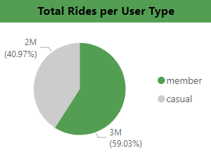
From the above we can see that majority of Cyclistic users are Anuual member and the main focus is converting the 40% who are casual members to annual members.

**2. How are rides distributed throughout the week among Cyclistic users?**
   
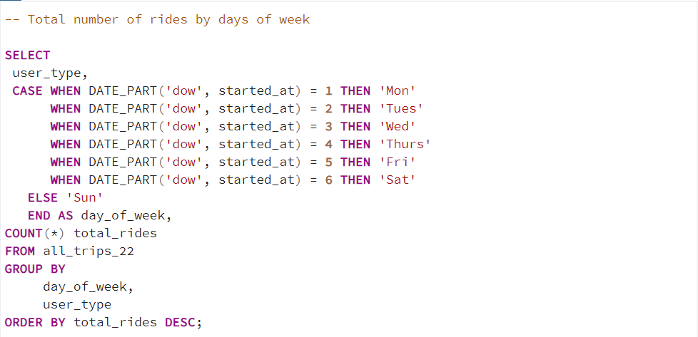   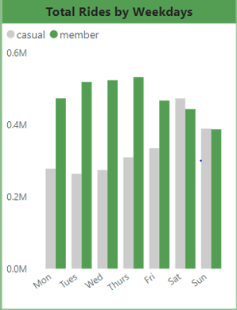

**3. What is the monthly distribution pattern of rides among Cyclistic users?**
   
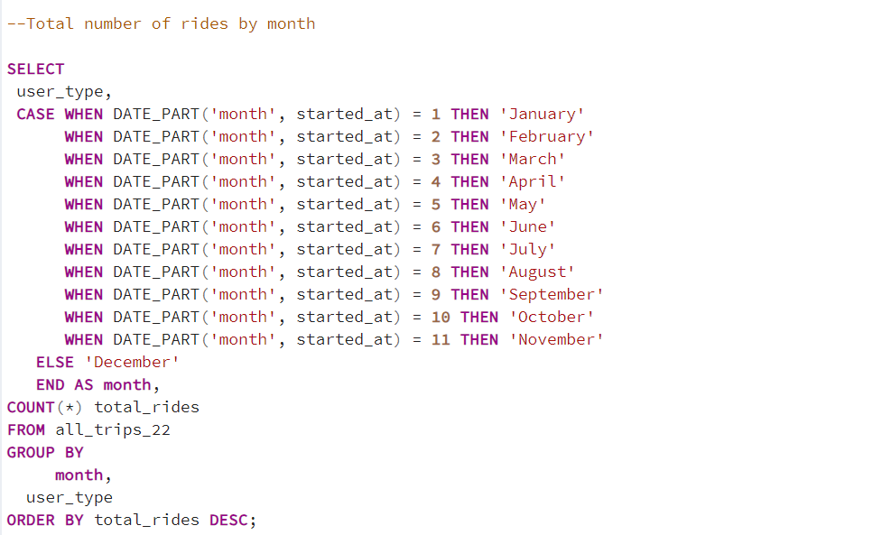   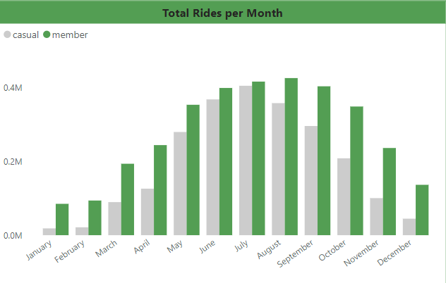

**4. What is the daily distribution pattern of rides among Cyclistic users?**
   
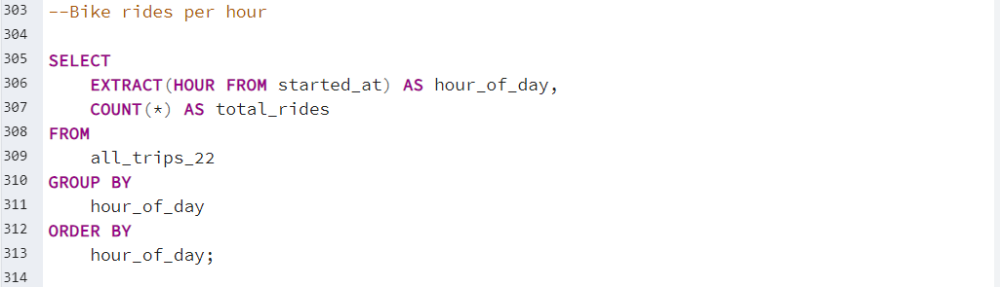   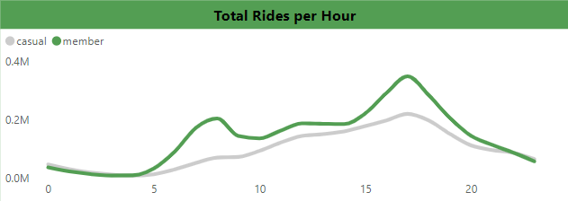

**5. What is the average duration of rides taken by Cyclistic users?**
   
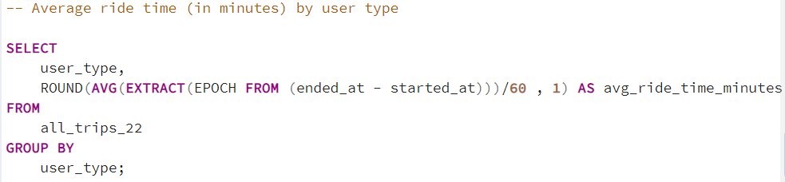   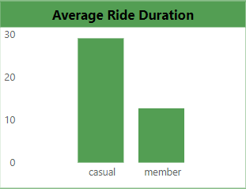

**6. Which bike type is most preferred by Cyclistic users?**
    
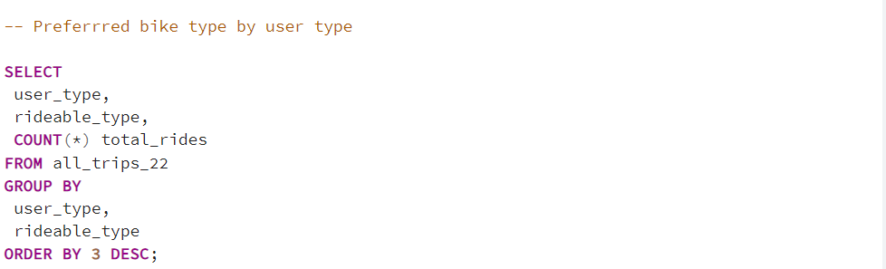   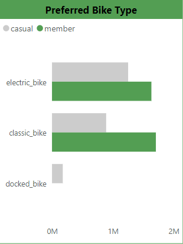

From the above, we can seee that the preferred bike for annual members is the classic bikes while that of casual users is electric bikes. Also, we can see that annual members do not use docked bikes at all.

