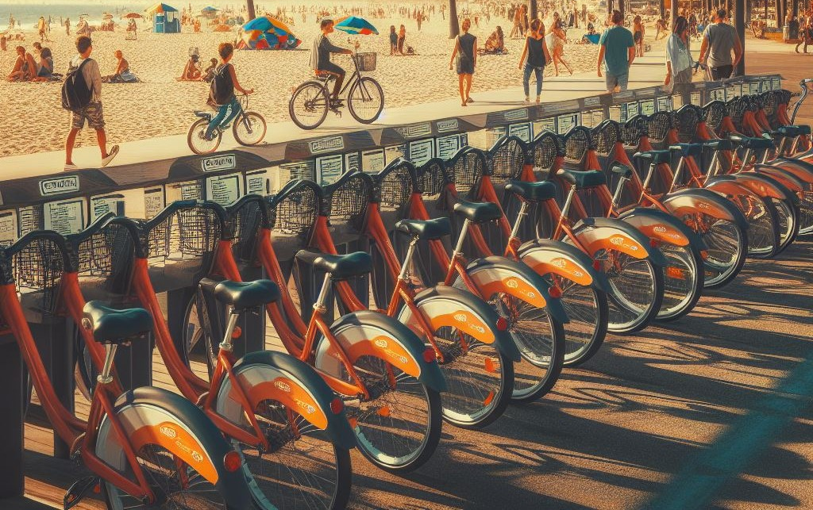
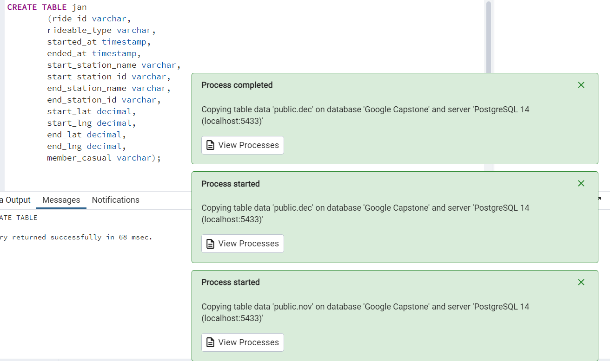
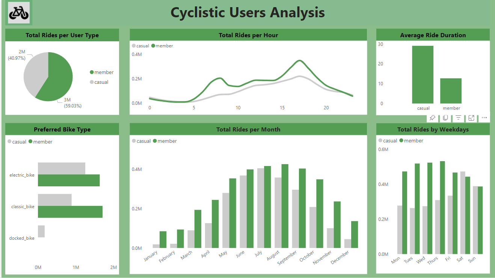

# Introduction
This is the Google Data Analytics Capstone project. For the purpose of this project, I assume the role of a Junior Data Analyst at a fictitious bike rental company, Cyclistic. This project involves understanding business questions, proferring data- driven solutions and sharing findings through data visulaization and reports. 

# Skills Demonstrated
For the effective execution of this project, the following skills were utilized;
1. Understanding of business problem.
2. Data analysis with SQL utilizing various DDL, DQL, DDL and DML.
3. Sharing insights through compelling data visualisation and reports.
4. Critical and creative thinking.
5. Problem solving

# Dataset
The dataset used was provided by Google and can be found [here](https://divvy-tripdata.s3.amazonaws.com/index.html). The data consists of 12 months data including 13 columns and upon joining the 12 months data together, 5,667,717 rows. One limitation of the dataset is the presence of lots of blanks under the Start and End station name columns. Save for that, the data is reliable, complete, current and comprehensive, with relevant columns and does not contain duplicates.

# Problem Statement
Cyclistic, a bike rental company, offers flexible pricing plans including single-ride passes, full-day passes, and annual memberships. Although profitable overall, a financial analysis has revealed that annual memberships yield the highest profitability. Consequently, rather than a generic campaign, the marketing team intends to target casual riders with the goal of converting them to annual members. To accomplish this, they aim to understand the user behavior of both casual and annual members, identifying differences and similarities, and exploring how digital media can influence their marketing strategies. This will involve analyzing Cyclistic's historical trip data to uncover trends.

The following business questions will be answered to gain required insights;

1. How does the total number of rides vary between different user types?
2. How are rides distributed throughout the week among Cyclistic users?
3. What is the monthly distribution pattern of rides among Cyclistic users?
4. What is the daily distribution pattern of rides among Cyclistic users?
5. What is the average duration of rides taken by Cyclistic users?
6.  Which bike type is most preferred by Cyclistic users?

# Process
For the execution of this project, SQL will be utilized for indepth analysis and Power BI for the visualization and sharing of insights to key stakeholders.
ALL codes used for indepth analysis can be found [here](GDA_cyclystic_capstone_project)

I started off by creating tables and loading the 12 months data into postgresql.

Then, went ahead to combine all 12 months data into a single view for easy and proper analysis.

Before commensing indepth analysis, I changed the column name 'member-casual' to 'user-type' for clarity

# Data Analysis

**1. How does the total number of rides vary between different user types?**
   
   

From the above we can see that majority of Cyclistic users are Anuual members and the main focus is converting the 40% who are casual members to annual members.

**2. How are rides distributed throughout the week among Cyclistic users?**
   
   

Annual members consistently take more rides during the working days of the week and this can be as a result cycling to and from work while casual members takes dominance during the weekend, mostly Saturdays. Understanding this, the Marketing team can organise marketing campaigns for increased awareness and engagement amongst casual riders, highlighting the benefits of owning an Annual membership.They can also consider offering annual membership for weekend use only. 

**3. What is the monthly distribution pattern of rides among Cyclistic users?**
   
   

There is a significant increase in the number of rides during the summer time and this can be as a result of the good weather and increase in tourists during those periods. The Marketing Team can tailor promotional campaigns highlighting the benefits of annual membership and offering incentives like discounts or priority service during peak period to annual members.

**4. What is the daily distribution pattern of rides among Cyclistic users?**
   
   

There is a notabe increase in rides between 7am to 9am, corresponding with the typical morning commute hours, suggesting that most annual members use Cyclistic bikes as a mode of transportation to work or morning appointments. For the casual users,despite taking fewer rides compared to annual members, casual users exhibit a different usage trend characterised by a slow but steady increase in rides from 7am to 7pm. This suggests that casual users may utilise Cyclistic bikes for a variety of purposes throughout the day, including, leisure rides, errands, or recreational activities. The consistent increase in rides throughout the day indicates that Cyclistic bikes appeal to casual users as a flexible and accessible transportationoptions beyond the traditional communting hours.Being equipped with this, the Marketing Team can tailor a campaign or promotions, focused on relaying the benefits of Annual membership over pay-per ride.

**5. What is the average duration of rides taken by Cyclistic users?**
   
   

Casual users ride longer distance than anuual members. They ride twice as long as annual members. This suggests that Casual users may use Cyclistic bikes for different purposes compared to Annual members. While annual members may primarily use the service for shorter, more frequent rides such as commuting to work, Casual riders are likely utilizing the bikes for leisure or recreational activities that invoolve longer distances and duration. Understanding the differing usage behaviour between both users can inform the design and customisation of membership benefits to best meet the needs and preferences of both users. 

**6. Which bike type is most preferred by Cyclistic users?**
    
   

From the above, we can seee that the preferred bike for annual members is the **classic bikes** while that of casual users is **electric bikes**. The docked bike is the least popular among users and while few casual users still use the docked bikes, annual members do not use it at all. This may be as a result of issues relating to availability or accessibility. 

# Recommendation
Some of the recommendations to convert casual users to annual users include
1. Introduce membership tiers or add-ons that cater to casual users' preferences for longer rides, such as extended ride durations, discounted rates for longer trips, or access to exclusive leisure routes or destinations.
2. Design and customize membership benefits to best meet the needs and preferences of both users - Annual members, primarily for commuting to work and Casual members for leisure and recreation.
3. Introduce a week-end only annual membership.
4. Design a Marketing campaign highlighting the benefits of Annual membership and offering a limited discount for immediate sign up.
5. Prioritising Annual members during peak periods.
   
# Dashboard

